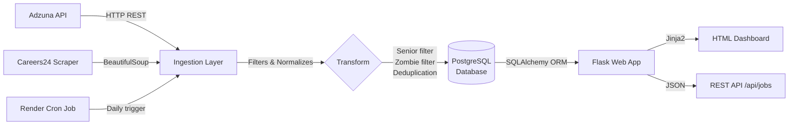

# 🇿🇦 South African Job Market Pipeline & Tracker


> A production-grade data engineering project that automatically collects, cleans, deduplicates, stores, and visualizes entry-level tech jobs — updated daily via a scheduled pipeline.

**[🚀 View Live Demo](https://entry-job-market-pipeline.onrender.com/)** · **[📊 Analytics Dashboard](https://entry-job-market-pipeline.onrender.com/stats)** · **[🔌 REST API](https://entry-job-market-pipeline.onrender.com/api/jobs)**

---

## 📖 The Problem This Solves

Finding entry-level tech jobs is fragmented and frustrating:
- Job aggregators show **expired "zombie" listings**
- Filtering for true "0–2 years experience" roles is unreliable
- There's no single place for both **SA local** and **global remote** data roles

This project solves that with a **fully automated daily pipeline** that ingests, cleans, and presents only fresh, relevant opportunities.

---

## 🏗️ Architecture



**Pipeline Stages:**
1. **Extract** — Adzuna API (SA + 6 global countries) + Careers24 web scraper
2. **Transform** — "Zombie filter" (rejects old-year titles), seniority gatekeeper, deduplication by `source_job_id`
3. **Load** — Upsert into PostgreSQL with SCD Type 1 tracking (`first_seen_at`, `last_seen_at`, `is_active`)
4. **Retention** — Auto-cleanup: deletes jobs > 30 days old, enforces 1,500-row hard limit
5. **Serve** — Flask REST API + Chart.js analytics dashboard

---

## 🛠️ Tech Stack

| Layer | Technology |
|---|---|
| Language | Python 3.10+ |
| Web Framework | Flask 3.0 (Blueprints architecture) |
| Database | PostgreSQL (prod) · SQLite (local dev) |
| ORM | SQLAlchemy + Flask-SQLAlchemy |
| ETL | `requests` · `BeautifulSoup4` |
| Frontend | Custom CSS design system · Chart.js 4 · Jinja2 |
| Testing | Pytest |
| Deployment | Render (Web Service + Cron Job) |

---

## 🚀 Key Features

- **Hybrid Ingestion** — Structured API data + unstructured HTML scraping in one pipeline
- **Smart Filtering** — Entry-level enforcement via keyword analysis across title AND description
- **Salary Data** — Displays salary range badges on job cards where available (from Adzuna)
- **Deduplication** — `source + source_job_id` unique constraint prevents duplicate listings
- **Async Pipeline Refresh** — Manual refresh runs in a background thread; UI shows live status
- **Analytics Dashboard** — 4 Chart.js charts: source breakdown, top locations, skill demand, 14-day trend
- **Pagination** — 20 jobs per page with full page navigation
- **REST API** — `/api/jobs`, `/api/stats`, `/api/health` endpoints with query params
- **Data Retention** — Automated cleanup policy to keep free-tier DB healthy

---

## 🚀 How to Run Locally

### Prerequisites
- Python 3.10+
- Git

### 1. Clone and set up the environment
```bash
git clone https://github.com/ntokozo078/entry-job-market-pipeline.git
cd entry-job-market-pipeline
python -m venv venv

# Windows
venv\Scripts\activate
# macOS/Linux
source venv/bin/activate

pip install -r requirements.txt
```

### 2. Configure environment variables
```bash
cp .env.example .env
# Edit .env and add your Adzuna API keys
# Get free keys at: https://developer.adzuna.com/
```

### 3. Initialize the database and run
```bash
python run.py
```

The app will start on `http://localhost:5000`. It uses SQLite locally — no PostgreSQL setup needed.

### 4. Run the pipeline manually
```bash
python run_pipeline.py
```

### 5. Run tests
```bash
python -m pytest tests/ -v
```

---

## 🔌 API Reference

| Endpoint | Method | Description |
|---|---|---|
| `/api/jobs` | GET | List active jobs. Params: `type`, `location`, `source`, `limit` |
| `/api/stats` | GET | Aggregate counts by source |
| `/api/health` | GET | DB health check — returns 200 OK or 503 |

**Example:**
```bash
# Get junior Python jobs in Johannesburg
curl "https://entry-job-market-pipeline.onrender.com/api/jobs?type=python&location=johannesburg"
```

---

## 💡 Challenges & Solutions

| Challenge | Solution |
|---|---|
| **Render free tier kills idle DB connections** | `pool_pre_ping=True` + `pool_recycle=300` in SQLAlchemy engine options |
| **Synchronous refresh blocked the web server** | Moved pipeline to a background `threading.Thread`; frontend polls `/refresh/status` |
| **Careers24 DOM changes break the scraper** | Multiple CSS selector fallbacks; try/except per card; silently skips broken cards |
| **"Zombie jobs" — listings years old** | Regex year extractor in title; rejects any title with a year > 1 year in the past |
| **Adzuna API rate limits & timeouts** | Circuit breaker (50-job cap per run), 0.2s sleep between requests, per-exception error handling |
| **In-memory skill counting was O(n) on all titles** | Replaced with parameterized SQL `LIKE` count queries — O(1) per skill |

---

## 🗺️ Future Improvements

- [ ] Email digest: subscribe to daily job alerts by category
- [ ] Salary histogram on the analytics dashboard
- [ ] Filter sidebar (by source, location, job type) without full page reload
- [ ] Glassdoor/LinkedIn data source integration
- [ ] Full-text search with PostgreSQL `tsvector`
- [ ] Containerize with Docker for easier local setup

---

## 📄 License

MIT License — feel free to fork and adapt for your own job market.

---

*Built by Ntokozo · Flask + Python + PostgreSQL · Hosted on Render*
